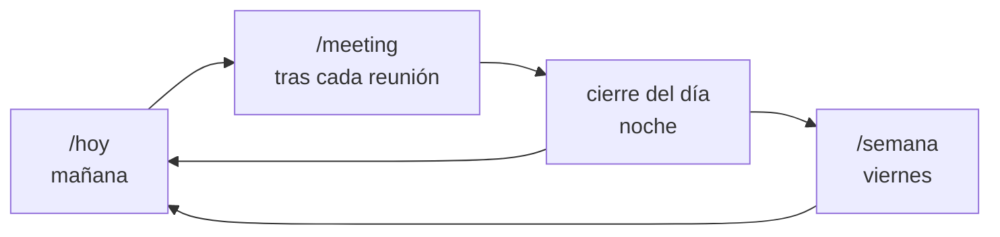

# La metodología, al grano

## El problema que resuelve

En un rol de gestión, el valor de tu sistema se mide en tres preguntas:
¿qué acordé con X?, ¿por qué decidimos Y?, ¿qué está trabado y de quién depende?
Si tardás más de 30 segundos en responder cualquiera, estás gestionando de memoria.
Y la memoria pierde: los compromisos no se rompen, **desaparecen**.

Un second brain clásico (PARA, notas atómicas, links) no alcanza: es un archivo,
no un radar. Sabe todo, pero solo cuando vos vas a preguntarle — y el día a día
no te deja ir a preguntarle. **Guardar no es gestionar.**

## Las cuatro piezas

**Dailies** — El motor. Todo entra por `Daily/YYYY-MM-DD.md`: foco del día (top 3
a destrabar/decidir, NO tareas a ejecutar), decisiones, bloqueos, personas tocadas
y cierre del día con números.

**Personas** — Una nota por persona en `05-People/` con sus **acuerdos vivos**.
La agenda de cada 1a1 sale de ahí: los acuerdos viejos primero. El contacto sin
prep no cierra nada.

**Radar de bloqueos** — `02-Areas/Bloqueos.md`. Cada bloqueo con owner y fecha de
origen. Más de 14 días sin update sustantivo = 🧟 zombie: se mata por escrito o se
resucita con fecha, nunca se acumula.

**Weekly** — `Daily/Weekly/YYYY-Www.md`. La escribe el agente, no vos. Métricas
contra la semana anterior, patrones, y un veredicto honesto.

## El ciclo

## Qué caza la weekly

- **✅ falsos** — cierres sin evidencia. Se reclasifican como abiertos.
- **Loops desaparecidos** — estaba en el radar y no aparece en ningún daily.
  No está resuelto: está invisible. Peor.
- **Zombies** — bloqueos >14 días sin movimiento real.
- **Role drift** — trabajo que hiciste vos y era de tu equipo (o al revés,
  según cómo definas valor en tu CLAUDE.md).
- **Foco hit-rate** — qué declaraste como foco vs qué outcome quedó registrado.

## Métricas sugeridas (rol de gestión)

Bloqueos resueltos con evidencia · bloqueos creados · bloqueos abiertos al cierre ·
decisiones tomadas (y su distribución en la semana) · personas tocadas ·
tareas fuera de rol (objetivo 0) · cierres del día completos · energía media.

No midas tareas hechas. Eso es métrica de individual contributor.

## Lecciones que están cocinadas en los comandos

- **El arrastre se hace desde la fuente, nunca de memoria.** Tras un hueco
  (vacaciones, feriados), los bloqueos se arrastran leyendo el último daily real.
- **Cuando un bloqueo no se puede decir en una frase, el problema no es el owner** —
  está mal definido, o no es tuyo.
- **Foco que apunta a una reunión → outcome en el daily**, aunque sea una línea.
  Las salas se tragan los focos sin dejar rastro.
